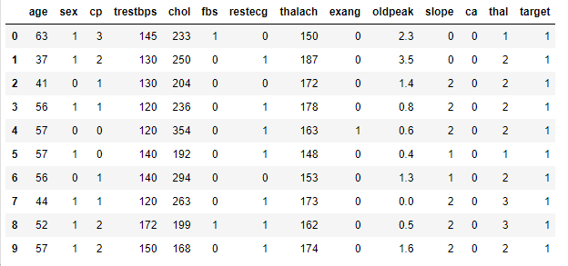

# 复现Kaggle心脏病数据集冠军kernel，理解所用的模型可解释性技巧

## 1. 导入工具包

```python
# 数据处理
import numpy as np
import pandas as pd
# 基础图形绘制
import matplotlib.pyplot as plt
import seaborn as sns
# 模型
from sklearn.ensemble import RandomForestClassifier # 随机森林分类器
from sklearn.tree import DecisionTreeClassifier # 决策树分类器
from sklearn.tree import export_graphviz # 使用graphviz打印树结构
# 模型评价指标
from sklearn.metrics import roc_curve, auc # ROC曲线，AUC
from sklearn.metrics import classification_report #
from sklearn.metrics import confusion_matrix # 混淆矩阵
# 划分训练集和测试集
from sklearn.model_selection import train_test_split
# 用于排列重要性
import eli5 # 允许使用统一API可视化地调试各种机器学习模型
from eli5.sklearn import PermutationImportance
# 计算shap值，提供极其强大的数据可视化功能，来展示模型或预测的解释结果
import shap
# A plot toolbox to visualize the impact of certain features towards model prediction for any supervised learning algorithm
from pdpbox import pdp, info_plots
```

## 2. 读取数据

```python
df = pd.read_csv("./input/heart.csv")
```

查看前10行数据内容。

```python
df.head(10)
```

输出结果：



检查数据内容，可以看到数据比较干净，没有缺失值。

```python
df.info()
```

输出结果：

```
<class 'pandas.core.frame.DataFrame'>
RangeIndex: 303 entries, 0 to 302
Data columns (total 14 columns):
 #   Column    Non-Null Count  Dtype  
---  ------    --------------  -----  
 0   age       303 non-null    int64  
 1   sex       303 non-null    int64  
 2   cp        303 non-null    int64  
 3   trestbps  303 non-null    int64  
 4   chol      303 non-null    int64  
 5   fbs       303 non-null    int64  
 6   restecg   303 non-null    int64  
 7   thalach   303 non-null    int64  
 8   exang     303 non-null    int64  
 9   oldpeak   303 non-null    float64
 10  slope     303 non-null    int64  
 11  ca        303 non-null    int64  
 12  thal      303 non-null    int64  
 13  target    303 non-null    int64  
dtypes: float64(1), int64(13)
memory usage: 33.3 KB
```

各列含义如下：  

- **age**: 年龄
- **sex**: 性别 (1 = male, 0 = female)
- **cp:** Chest pain，是否有胸口痛的经历(Value 1: typical angina, Value 2: atypical angina, Value 3: non-anginal pain, Value 4: asymptomatic)
- **trestbps:** 入院时的静息血压 (单位mm Hg)
- **chol:** 胆固醇测量值（单位mg/dl）
- **fbs:** 空腹血糖是否大于120mg/dl (1 = true; 0 = false) 
- **restecg:** 静息心电图测量 (0 = normal, 1 = having ST-T wave abnormality, 2 = showing probable or definite left ventricular hypertrophy by Estes' criteria)
- **thalach:** 最大心率
- **exang:** 运动引发心绞痛 (1 = yes; 0 = no)
- **oldpeak:** 相对于休息状态，运动引发的ST段降低 ('ST' relates to positions on the ECG plot. See more [here](https://litfl.com/st-segment-ecg-library/))
- **slope:** 运动峰值ST段的斜率方向(Value 1: upsloping, Value 2: flat, Value 3: downsloping)
- **ca:** 主要血管数量 (0-3)
- **thal:** 地中海贫血症 (1 = normal; 2 = fixed defect; 3 = reversable defect)
- **target:** 是否患有心脏病，标签 (0 = no, 1 = yes)

为了避免[HARKing](https://journals.sagepub.com/doi/abs/10.1207/s15327957pspr0203_4) (Hypothesizing After the Results are Known),可以先查阅相关文献内容，了解各个特征的含义和他们在临床诊断中与心脏病的关系，便于检查模型是否学到了较为有用的知识。

## 3.数据预处理

首先修整一下列名，使列名含义更清晰。

```python
df.columns = ['age', 'sex', 'chest_pain_type', 'resting_blood_pressure', 'cholesterol', 'fasting_blood_sugar', 'rest_ecg', 'max_heart_rate_achieved',
       'exercise_induced_angina', 'st_depression', 'st_slope', 'num_major_vessels', 'thalassemia', 'target']
```

将数字类别改为对应内容，便于后续展示。

```python
df['sex'][df['sex'] == 0] = 'female'
df['sex'][df['sex'] == 1] = 'male'

df['chest_pain_type'][df['chest_pain_type'] == 1] = 'typical angina'
df['chest_pain_type'][df['chest_pain_type'] == 2] = 'atypical angina'
df['chest_pain_type'][df['chest_pain_type'] == 3] = 'non-anginal pain'
df['chest_pain_type'][df['chest_pain_type'] == 4] = 'asymptomatic'

df['fasting_blood_sugar'][df['fasting_blood_sugar'] == 0] = 'lower than 120mg/ml'
df['fasting_blood_sugar'][df['fasting_blood_sugar'] == 1] = 'greater than 120mg/ml'

df['rest_ecg'][df['rest_ecg'] == 0] = 'normal'
df['rest_ecg'][df['rest_ecg'] == 1] = 'ST-T wave abnormality'
df['rest_ecg'][df['rest_ecg'] == 2] = 'left ventricular hypertrophy'

df['exercise_induced_angina'][df['exercise_induced_angina'] == 0] = 'no'
df['exercise_induced_angina'][df['exercise_induced_angina'] == 1] = 'yes'

df['st_slope'][df['st_slope'] == 1] = 'upsloping'
df['st_slope'][df['st_slope'] == 2] = 'flat'
df['st_slope'][df['st_slope'] == 3] = 'downsloping'

df['thalassemia'][df['thalassemia'] == 1] = 'normal'
df['thalassemia'][df['thalassemia'] == 2] = 'fixed defect'
df['thalassemia'][df['thalassemia'] == 3] = 'reversable defect'
```

检查数据类型。

```python
df.dtypes
df.describe(include='O')
```

输出结果：

```
age                          int64
sex                         object
chest_pain_type             object
resting_blood_pressure       int64
cholesterol                  int64
fasting_blood_sugar         object
rest_ecg                    object
max_heart_rate_achieved      int64
exercise_induced_angina     object
st_depression              float64
st_slope                    object
num_major_vessels            int64
thalassemia                 object
target                       int64
dtype: object
```


thalassemia除了1,2,3外，还有0值，猜测是缺失值补齐。

```python
df['thalassemia'].unique()
```

输出结果：

```
array(['normal', 'fixed defect', 'reversable defect', 0], dtype=object)
```

对类别特征进行one-hot编码。

```python
df = pd.get_dummies(df, drop_first=True)
```

检查一下thalassemia为0的项，可以看到两条thalassemia为0的数据在one-hot编码后对应三列均为0，没有为0生成一列。

```python
df[(df['thalassemia_fixed defect'] == 0)&(df['thalassemia_normal']==0) & (df['thalassemia_reversable defect']==0)]
```

输出结果：


## 4.模型

将数据拆分成训练集和测试集，抽取20%的数据作为测试集，random_state用于将随机种子进行固定，保证每次随机结果相同。

```python
X_train, X_test, y_train, y_test = train_test_split(df.drop('target', 1), df['target'], test_size = 0.2, random_state=10)
```

使用最大深度为5的随机森林分类器尝试对数据进行拟合。

```python
model = RandomForestClassifier(max_depth=5)
model.fit(X_train, y_train)
```

输出结果：

```
RandomForestClassifier(bootstrap=True, class_weight=None, criterion='gini',
            max_depth=5, max_features='auto', max_leaf_nodes=None,
            min_impurity_decrease=0.0, min_impurity_split=None,
            min_samples_leaf=1, min_samples_split=2,
            min_weight_fraction_leaf=0.0, n_estimators=10, n_jobs=None,
            oob_score=False, random_state=None, verbose=0,
            warm_start=False)
```

画出将树的分支结构，观察各节点划分依据。

```python
estimator = model.estimators_[1]
feature_names = [i for i in X_train.columns]

y_train_str = y_train.astype('str')
y_train_str[y_train_str == '0'] = 'no disease'
y_train_str[y_train_str == '1'] = 'disease'
y_train_str = y_train_str.values

export_graphviz(estimator, out_file='tree.dot', 
                feature_names = feature_names,
                class_names = y_train_str,
                rounded = True, proportion = True, 
                label='root',
                precision = 2, filled = True)

from subprocess import call
call(['dot', '-Tpng', 'tree.dot', '-o', 'tree.png', '-Gdpi=600'])

from IPython.display import Image
Image(filename = 'tree.png')
```


从图中可以看到每个节点的划分情况，当新数据输入时，也可以根据此结构快速判断数据所属的分类，但是在图中无法直接体现出各特征的重要性。

使用混淆矩阵来评估一下当前学习到的模型在测试集上的效果。

```python
# 在测试集上获取预测结果
y_predict = model.predict(X_test)
y_pred_quant = model.predict_proba(X_test)[:, 1]
y_pred_bin = model.predict(X_test)

confusion_matrix = confusion_matrix(y_test, y_pred_bin)
confusion_matrix
```

输出结果：

```
array([[28,  7],
       [ 4, 22]], dtype=int64)
```

在临床诊断中，常用特异性(Specificity)和敏感性(Sensitivity)作为衡量结果的评价指标，具体定义如下：
$$Specificity=\frac{True Negative}{True Negative + False Positive}$$ 

$$Sensitivity=\frac{True Positives}{True Positives + False Negatives}$$

下面来看一下当前模型的特异性和敏感性。

```python
total=sum(sum(confusion_matrix))

sensitivity = confusion_matrix[0,0]/(confusion_matrix[0,0]+confusion_matrix[1,0])
print('Sensitivity : ', sensitivity )

specificity = confusion_matrix[1,1]/(confusion_matrix[1,1]+confusion_matrix[0,1])
print('Specificity : ', specificity)
```

输出结果：

```
Sensitivity :  0.875
Specificity :  0.7586206896551724
```

看起来结果还不错，可以进一步使用受试者工作特征曲线（**R**eceiver **O**perator **C**urve）进行结果评估。ROC曲线的横坐标是假正例率（FPR=1-特异性），纵坐标是真正例率（TPR=敏感性），绘制过程中，需要对数据预测结果的概率进行降序排序，然后从大到小取不同的阈值，将大于阈值的数据划分为正例，计算TPR和FPR并绘制对应的点，直到全部数据被分为正例，绘制完成。ROC曲线离左上角越近表示分类结果越好，随机划分的分类器ROC曲线是左下到右上的对角线。

```python
fpr, tpr, thresholds = roc_curve(y_test, y_pred_quant)

fig, ax = plt.subplots()
ax.plot(fpr, tpr)
ax.plot([0, 1], [0, 1], transform=ax.transAxes, ls="--", c=".3")
plt.xlim([0.0, 1.0])
plt.ylim([0.0, 1.0])
plt.rcParams['font.size'] = 12
plt.title('ROC curve for heart disease classifier')
plt.xlabel('False Positive Rate (1 - Specificity)')
plt.ylabel('True Positive Rate (Sensitivity)')
plt.grid(True)
```

输出结果：


另一个常用指标是ROC曲线下面积（**A**rea **U**nder the **C**urve），这是一种很简便的模型评价方式，是对ROC曲线的积分，该面积越大说明效果越好，一般分为以下几个等级：

- 0.90 - 1.00 = excellent
- 0.80 - 0.90 = good
- 0.70 - 0.80 = fair
- 0.60 - 0.70 = poor
- 0.50 - 0.60 = fail

```python
auc(fpr, tpr)
```

输出结果：0.8846153846153846

## 5.可解释性

**Permutation importance**工具包可以用于理解机器学习模型，它会通过依次打乱验证集数据中各个特征的值来检查模型的效果变化，如果某特征打乱后对结果没有明显影响，说明该特征重要性较低，反之亦然。

```python
perm = PermutationImportance(model, random_state=1).fit(X_test, y_test)
eli5.show_weights(perm, feature_names = X_test.columns.tolist())
```

输出结果：


如图所示，绿色部分表示正相关，红色部分表示负相关，颜色越深，权重的绝对值越大，表示相关程度越大，中间权重为0的结果标识修改该特征对结果没有明显影响。

另一个可用的工具包是**Partial Dependence Plots（pdp）**，其作用方式与Permutation importance类似，它会对每个特征依次取该特征的各个值，并展示预测结果的变化。  
在使用本工具包时，可能会出现**TypeError: clabel() got an unexpected keyword argument 'contour_label_fontsize'**，原因是对应方法的参数名有变动，但是release版本中并没有进行更新，解决方法是找到并修改pdpbox/pdp_plot_utils.py 第251行inter_ax.clabel(c2, contour_label_fontsize=fontsize, inline=1)，将contour_label_fontsize改为fontsize即可（[原Github issue](https://github.com/SauceCat/PDPbox/issues/40)）。 

```python
base_features = df.columns.values.tolist()
base_features.remove('target')

feat_name = 'num_major_vessels'
pdp_dist = pdp.pdp_isolate(model=model, dataset=X_test, model_features=base_features, feature=feat_name)

pdp.pdp_plot(pdp_dist, feat_name)
plt.show()
```

输出结果：


图中红色虚线是基准线，Y轴表示预测相较于基准线的变化，X轴是该特征的全部取值，蓝色实线表示变化均值，阴影区域表示置信区间。从图上可以看出，主血管数量越多，得心脏病的几率就越小，但是在增加到一定程度后几率就不再降低了。

```python
feat_name = 'age'
pdp_dist = pdp.pdp_isolate(model=model, dataset=X_test, model_features=base_features, feature=feat_name)

pdp.pdp_plot(pdp_dist, feat_name)
plt.show()
```

输出结果：


从上图中看，年龄越大得心脏病的几率越小，比较奇怪，可能是数据采样导致的问题。

```python
feat_name = 'st_depression'
pdp_dist = pdp.pdp_isolate(model=model, dataset=X_test, model_features=base_features, feature=feat_name)

pdp.pdp_plot(pdp_dist, feat_name)
plt.show()
```

输出结果：


st_depression代表运动引起的ST段压低，从图中可以看到随着该特征取值变大，患心脏病的可能性随之不断降低。此结果与部分专业资料内容不符，猜测该特征可能会与其他特征（如st_slop_flat）共同作用，下面使用2D PDP进行验证。

```python
inter1  =  pdp.pdp_interact(model=model, dataset=X_test, model_features=base_features, features=['st_slope_upsloping', 'st_depression'])

pdp.pdp_interact_plot(pdp_interact_out=inter1, feature_names=['st_slope_upsloping', 'st_depression'], plot_type='contour')
plt.show()

inter1  =  pdp.pdp_interact(model=model, dataset=X_test, model_features=base_features, features=['st_slope_flat', 'st_depression'])

pdp.pdp_interact_plot(pdp_interact_out=inter1, feature_names=['st_slope_flat', 'st_depression'], plot_type='contour')
plt.show()
```

输出结果：


图中颜色由浅色到深色表示预测概率降低，可以看到无论st_slope_flat取值为0或1，结果都是st_depression越高，患病概率越低。

下面尝试一下Shap值（SHapley Additive exPlanation），有助于细分预测以显示每个特征的影响。它基于Shapley values，这是一种用于博弈论的技术，用于确定协作游戏中每个玩家促成其成功的贡献有多少¹。通常情况下，在准确性和可解释性之间取得正确的权衡可能是一个困难的平衡行为，但SHAP值可以同时提供这两者([Ref](https://blog.csdn.net/qq_42793029/article/details/94459036))。

```python
explainer = shap.TreeExplainer(model)
shap_values = explainer.shap_values(X_test)

shap.summary_plot(shap_values[1], X_test, plot_type="bar")
```

输出结果：


主要血管数目排名最高，下面使用shap的summary plot进一步进行探索。

```python
shap.summary_plot(shap_values[1], X_test)
```

输出结果：


各点颜色显示数据集中这一行的特征值是高还是低，水平位置显示该值的影响是导致较高的预测还是较低的预测。
例如主要血管数目，左上角的点表示该特征约大，预测结果会随之降低，与之前的结论一致。
此外，很多特征的划分都很清晰，例如地中海贫血症的可逆缺陷，st波的斜率等等，值较低的部分和较高的部分对结果的影响是对立的，也显示出这些特征较为重要，对结果有影响。但是图中显示性别为男性（sex_male=1）时，患心脏病的概率较低，与领域知识的判断结果相悖。

下面我们选出个体病例，并查看各个特征是怎样去影响他们的预测结果的。

```python
def heart_disease_risk_factors(model, patient):
    # 使用TreeExplainer展示每个特征的贡献度大小和正负方向
    explainer = shap.TreeExplainer(model)
    shap_values = explainer.shap_values(patient)
    shap.initjs()
    return shap.force_plot(explainer.expected_value[1], shap_values[1], patient)
```

```python
data_for_prediction = X_test.iloc[1,:].astype(float)
heart_disease_risk_factors(model, data_for_prediction)
```

输出结果：


对于该病例，预测结果为0.3，基准值为0.5843，大部分特征的取值都为他的最终结果降低提供了贡献，包括主要血管数目，st波的降低等等。

下面对另一个病例进行同样检查。

```python
data_for_prediction = X_test.iloc[3,:].astype(float)
heart_disease_risk_factors(model, data_for_prediction)
```

输出结果：


该病例的预测结果是0.84，远高于前一位病例。原因是他没有主要血管和可逆的地中海贫血缺陷，并且st斜率为flat。

我们还可以使用SHAP依赖关系贡献图来查看特征对shap值的影响。

```python
ax2 = fig.add_subplot(224)
shap.dependence_plot('num_major_vessels', shap_values[1], X_test, interaction_index="st_depression")
```

可以看到主血管数目对shap值的影响比较大，但是点的颜色（即st抑制）没有明显的影响。

最后，可以使用force_plot来对多个样本进行解释，将上述形式旋转90度然后水平并排放置，我们可以看到50个病例的特征对结果造成的影响，显示一个可交互的预测和影响因素图。

```python
shap_values = explainer.shap_values(X_train.iloc[:50])
shap.force_plot(explainer.expected_value[1], shap_values[1], X_test.iloc[:50])
```

输出结果：


## 6.总结

本数据集已经比较老了，并且数据量不是很大，正确性没有保证，但是它可以作为一个基础数据集来让我们尝试不同的模型可解释性方法，学习整个分析过程。随着机器学习在智能医疗方面的应用加深，模型的可解释性变得越来越重要，人们会更加偏向去信任一个可解释的模型，而不是一个黑盒模型，即使黑盒的效果更好。本例中的许多方法也可以扩展到深度学习中，帮助解释神经网络的学习方向和结果。


## Reference：

https://www.kaggle.com/tentotheminus9/what-causes-heart-disease-explaining-the-model